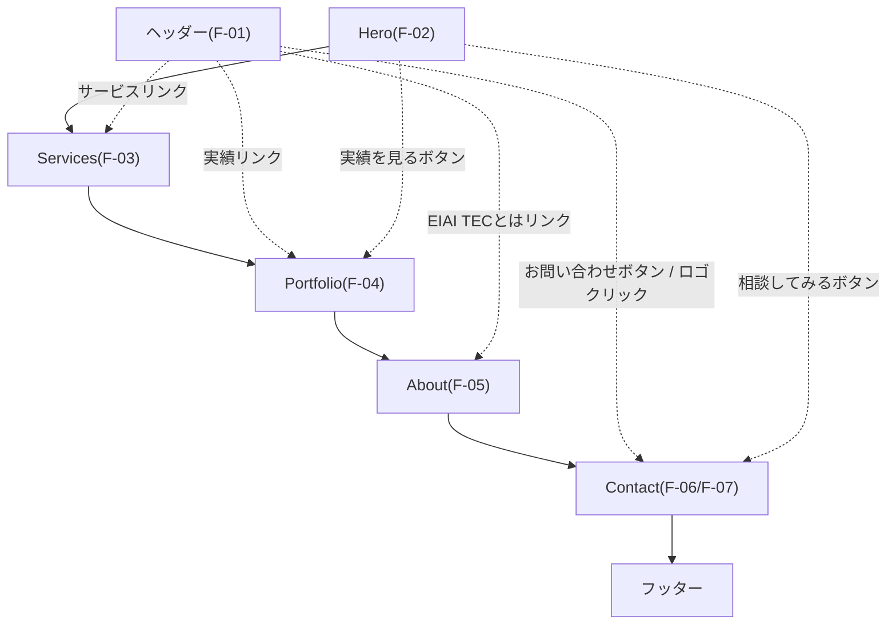
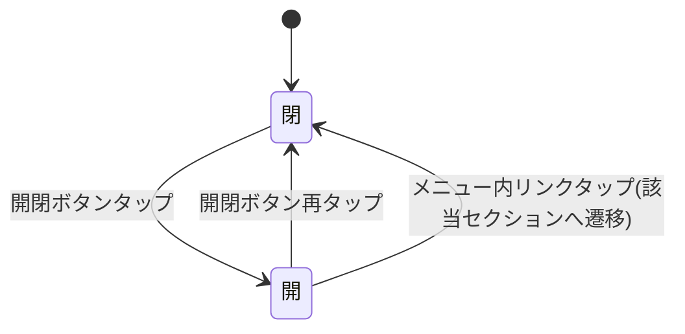
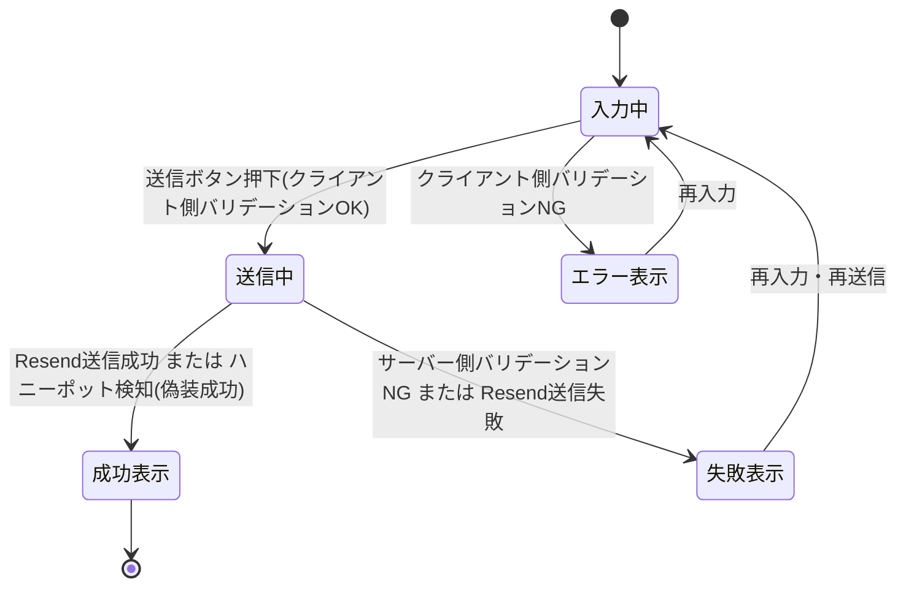

# EIAI TEC 公式サイト構築 基本設計書

## 1. 文書情報

- 作成日: 2026-09-10
- 版数: v1.2(初回イテレーション)
- 参照元: `docs/01_requirements/機能仕様書.md` v1.4(2026-09-09)、`docs/01_requirements/要件定義書.md` v1.4(2026-09-09)
- 参照元(上記経由の一次情報): `docs/00_overview/プロジェクト計画書.md`、`docs/00_overview/site-direction.md`、`docs/00_overview/進行モード.md`、`docs/00_overview/セキュリティチェック結果報告書.md` v1.2、`mockup/index.html`、`images/`配下の画像素材
- 対象機能: F-01〜F-11(機能仕様書3章)

## 2. システム概要

本サイトは、個人事業主EIAI TECの公式サイトであり、Hero/Services/Portfolio/About/Contactの5セクションから成るLP(ランディングページ)1枚構成のWebアプリケーションである。訪問者向けの動的な会員機能・検索機能等は持たず、確定済みの静的コンテンツ表示と、お問い合わせフォームからのメール送信(Resend API連携)のみを機能範囲とする。アプリケーション側でデータを永続化する要件はなく、DB(データベース)は採用しない。

見た目・コピーは`mockup/index.html`で確定済みであり、本設計書はこれをNext.js(App Router)アプリケーションとして実装するための技術構成・画面構成・データの流れ・外部連携方式を定めるものである。デザインの再検討は行わない(要件定義書6章・8章)。

### 2.1 採用技術

技術選定は要件定義書8章(制約条件)で確定済みの大枠(Next.js/App Router、Vercel、Resend)を前提に、本書で実装詳細レベルまで確定する。インフラ運用面(ドメイン取得タイミング等)を除き、以下はクライアント確認を要さないベンダー側の技術判断として確定する。

| 区分 | 採用技術 | 選定理由 |
|---|---|---|
| 実装言語 | TypeScript | Next.js標準構成であり、フォーム入力値・Resend APIレスポンス等の型を静的に検証できる。Coachingモードでの学習教材としても型情報が理解の助けになる。 |
| フレームワーク | Next.js(App Router)、React | 要件定義書8章で確定済み。SSR/SSG・Server Actions・next/imageなど本案件の要件(F-07, F-09, F-10)に必要な機能が標準搭載されている。 |
| ランタイム | Node.js 20系(LTS) | Vercelの標準サポート対象であり、Next.js最新安定版の動作要件を満たす。 |
| スタイリング | 素のCSS(グローバルCSS、CSS変数によるデザイントークン管理) | `mockup/index.html`の`:root`カラー変数・レイアウトCSSをそのまま移植することを優先し、Tailwind等のユーティリティCSSフレームワークは新規導入しない。デザイン変更を行わない方針(要件定義書6・8章)との整合性が高く、移植コストも最小になる。 |
| フォント配信 | `next/font/google`(Noto Sans JP / Inter / IBM Plex Mono) | 表示上のフォント銘柄はsite-direction.md §6を変更しないが、配信方式をGoogle Fonts CDN直リンクから`next/font`によるビルド時セルフホスティングへ変更し、表示速度を改善する(F-09の最適化方針と整合)。見た目・書体の変更ではないためデザイン変更には該当しない。 |
| フォーム送信処理 | Next.js Server Actions(`"use server"`) | お問い合わせフォーム(F-07)専用の公開APIエンドポイントを別途設計・保守する必要がなく、フォームからサーバー処理を直接呼び出せるため実装・学習コストが小さい。Route Handler(`/api/contact`)方式は将来的に外部から叩くAPIが必要になった場合の選択肢として詳細設計書7章に代替案として記載する。 |
| メール送信サービス | Resend(`resend` npm SDK) | 要件定義書8章で確定済み。 |
| 画像最適化 | `next/image` | 要件定義書6.9(F-09)で確定済み。 |
| データベース | 不採用 | 本サイトは静的コンテンツ表示とお問い合わせのメール転送のみを機能範囲とし、アプリケーション側でデータを永続化する要件がない(訪問者の入力内容もResend経由で転送するのみで保存しない方針。セキュリティチェック結果報告書11.3参照)。よってDB製品は選定しない。 |
| パッケージマネージャ | npm | Next.js公式テンプレートの既定であり、Coachingモードでの学習を考慮し特別な追加ツールを増やさない。 |
| ホスティング | Vercel | 要件定義書8章で確定済み。GitHubリポジトリ(`develop`/`main`)との連携によるプレビュー・本番自動デプロイを利用する。 |
| ドメイン管理 | 外部レジストラで`eiaitec.jp`を取得しVercelに接続(取得タイミングは公開直前) | 要件定義書8章・9章で確定済み(F-11)。 |

## 3. システム構成図

```mermaid
graph TD
    subgraph Visitor["訪問者環境"]
        A["ブラウザ<br/>(Next.jsが返すHTML/CSS/JS)"]
    end
    subgraph VercelPF["Vercel(ホスティング/実行基盤)"]
        B["Next.jsアプリケーション<br/>App Router: Server Components + Server Actions"]
    end
    subgraph ResendPF["Resend(メール配信API)"]
        C["Emails API<br/>POST /emails"]
    end
    D[("クライアント受信メールボックス<br/>環境変数 CONTACT_RECEIVE_EMAIL")]
    E["GitHubリポジトリ(public)<br/>develop / main"]
    F["ドメインレジストラ / DNS<br/>eiaitec.jp(F-11)"]

    A -- HTTPS --> B
    B -- お問い合わせ送信時のみ<br/>Server Action経由 --> C
    C -- メール配信 --> D
    E -- git push --> B
    F -. ドメイン紐付け(公開直前) .-> B
    F -. SPF/DKIM検証(6.2参照) .-> C
```

- 訪問者のブラウザとVercel上のNext.jsアプリケーションの間のみが常時発生する通信であり、Resend APIへの通信はお問い合わせフォーム送信時(F-07)のみ、サーバーサイド(Server Action内)から発生する。ブラウザから直接Resend APIを呼び出すことはない(APIキーをクライアントに渡さないため。セキュリティチェック結果報告書11.1参照)。
- GitHubリポジトリはpublicであり(同報告書6.2参照)、`develop`ブランチ・`main`ブランチへのpushがVercelの自動デプロイをトリガーする想定(具体的なブランチ運用ルールは実装フェーズで確定)。

## 4. 画面設計

本サイトは物理的に1ページ(LP)であるが、操作主体・表示状態が異なる3つの画面状態に分けて設計する。

### 4.1 トップページ(LP)- PC/タブレット表示

#### 画面レイアウト

- 既存の確定モックアップ(`../../mockup/index.html`)をそのまま実装対象のレイアウトとする。新規のビジュアルモックアップは作成しない(見た目・コピーは変更しないため)。
- 構成ブロック(上から順):
  1. ヘッダー(ロゴ+グローバルナビゲーション+お問い合わせボタン。画面上部に`position:sticky`で固定表示)
  2. Heroセクション(eyebrow・見出し・リード文・CTA2ボタン・ヒーロービジュアル)
  3. Servicesセクション(見出しブロック+装飾アイコン+3項目の行形式リスト)
  4. Portfolioセクション(見出しブロック+装飾アイコン+メタ事例カード1件)
  5. Aboutセクション(見出しブロック+ロゴ大+本文3段落)
  6. Contactセクション(見出しブロック+装飾アイコン+左カラム案内文+右カラムフォーム)
  7. フッター(ロゴ小+著作権表示)
- 画像スロットと素材の対応関係、favicon素材については5章(データ設計)で確定する。

#### 操作と実現内容

| 操作 | 実現内容 | 機能ID |
|---|---|---|
| ヘッダーのロゴをクリック | ページ最上部(Hero)へスクロール移動 | F-01 |
| ヘッダーの「サービス」をクリック | `#services`へスクロール移動 | F-01 |
| ヘッダーの「実績」をクリック | `#portfolio`へスクロール移動 | F-01 |
| ヘッダーの「EIAI TECとは」をクリック | `#about`へスクロール移動 | F-01 |
| ヘッダーの「お問い合わせ」ボタンをクリック | `#contact`へスクロール移動 | F-01 |
| Heroの「相談してみる」をクリック | `#contact`へスクロール移動 | F-02 |
| Heroの「実績を見る」をクリック | `#portfolio`へスクロール移動 | F-02 |
| Contactフォームの「送信する」を押下 | 4.3節「フォーム送信結果表示」の状態へ遷移 | F-07 |

- ヘッダーは画面幅640pxを超える場合にのみこのレイアウトで表示する。640px以下は4.2節(モバイル表示)に切り替わる(F-01)。
- eyebrowラベル(「Services」等)の文字サイズは、対応する見出しの表示幅に一致するようJavaScriptで動的計算する(計算式・実装方法は詳細設計書4章F-02〜F-06共通ロジックを参照)。

#### 画面遷移図



実線は自然なスクロール順、点線はクリックによるアンカージャンプを表す。物理的なページ遷移(URL遷移)は発生せず、すべて同一ページ内のスクロール移動である。

---

### 4.2 モバイル表示・ナビゲーションメニュー(F-08)

#### 画面レイアウト

- 画面幅640px以下では、ヘッダー内のグローバルナビゲーション(4.1節)を非表示にし、代わりにメニュー開閉ボタン(ハンバーガーアイコン)をヘッダー右側(お問い合わせボタンの左)に表示する。
- ボタンタップでメニューパネルを開閉する。パネルには「サービス」「実績」「EIAI TECとは」「お問い合わせ」の4リンクを縦並びで表示する。
- 意匠の詳細(ボタンの具体的な形状・アニメーション速度等の見た目)は、site-direction.md §6のデザイントークン(色: `--accent`系、フォント: Inter/Noto Sans JP)に沿って実装時に確定する。本イテレーションでは新規のビジュアルモックアップ(HTML/CSS)は作成せず、以下の「操作と実現内容」および状態遷移図をもって仕様とする。当面はシンプルな縦一列のドロップダウンパネル(ヘッダー直下に画面幅いっぱいで展開)とし、開閉のアイコン切り替え(ハンバーガー⇔×)を行う方針とする。

#### 操作と実現内容

| 操作 | 実現内容 | 機能ID |
|---|---|---|
| メニュー開閉ボタンをタップ(閉状態) | メニューパネルを開く。ボタンのアイコンを×に切り替える | F-08 |
| メニュー開閉ボタンをタップ(開状態) | メニューパネルを閉じる。ボタンのアイコンをハンバーガーに戻す | F-08 |
| メニュー内リンクをタップ | 該当セクションへスクロール移動し、メニューを自動的に閉じる | F-08 |

#### 状態遷移図



---

### 4.3 お問い合わせフォームの送信結果表示(F-07)

#### 画面レイアウト

- Contactセクションのフォーム(4.1節右カラム)の直上または直下に、送信結果を通知する領域(ステータス表示領域)を設ける。訪問者が結果を見落とさないよう、支援技術(スクリーンリーダー)にも通知されるライブリージョンとして実装する(詳細設計書8章参照)。
- 成功時・失敗時とも、フォーム自体の表示は維持する(失敗時に入力済み内容が失われないようにするため)。

#### 操作と実現内容

| 操作 | 実現内容 | 機能ID |
|---|---|---|
| 必須項目未入力のまま送信 | 送信を行わず、該当項目にエラー表示(8章参照) | F-07 |
| 全項目正しく入力し送信、Resend送信成功 | 成功メッセージを表示(文言は要確認事項、8章参照) | F-07 |
| 全項目正しく入力し送信、Resend送信失敗 | 失敗メッセージを表示。入力内容は保持し再送信可能とする | F-07 |
| ハニーポット欄に値が入った状態で送信(機械的送信) | 送信処理は行わないが、訪問者には成功時と同じ表示を返す | F-07 |

#### 状態遷移図



## 5. データ設計

本サイトはDBを持たないため、テーブル設計・ER図は作成しない(判断理由: 2.1節のとおりアプリケーション側でデータを永続化する要件がないため)。本節では、お問い合わせフォームが扱うデータの意味・関連と、画像・favicon等の静的アセットの対応関係を定義する。

### 5.1 お問い合わせフォームデータの意味・関連

お問い合わせ1件は、訪問者が送信ボタンを押した時点で「会社名・屋号」「お名前」「メールアドレス」「ご相談内容」の4項目がひとまとまりの入力データとして扱われ、Resend APIへのメール送信リクエストの本文として1回限り使用される。サーバー側・クライアント側のいずれにも保存されず、送信後はメモリ上に保持されない(セキュリティチェック結果報告書11.3の申し送りに基づく設計方針)。

| 項目名(論理名) | 役割 | 他項目との関連 |
|---|---|---|
| company(会社名・屋号) | メール本文中で相談者の所属を示す補足情報 | 任意項目のため、未入力時はメール本文で「未記入」等の表示に置き換える |
| name(お名前) | メール本文・件名で相談者を識別する主キー的な情報 | メール件名の組み立てに使用する |
| email(メールアドレス) | クライアントが返信する際の宛先 | Resend送信時の`reply_to`に設定し、クライアントがメールソフトで「返信」するだけで訪問者へ直接返信できるようにする |
| message(ご相談内容) | 相談内容そのもの。メール本文の主要部分 | - |
| honeypot(ハニーポット欄) | スパム送信の判定にのみ使用する制御用データ | 値が入っている場合、上記4項目はメール送信に使用せず処理を打ち切る(機能仕様書F-07参照) |

- 受信先(送信先)メールアドレスはフォーム入力データではなく、環境変数`CONTACT_RECEIVE_EMAIL`として管理するシステム側の固定設定値である(要件定義書10章No.14)。実アドレスは個人情報のためドキュメントに記載しない。

### 5.2 環境変数(設定データ)一覧

| 変数名 | 意味 | 値の性質 |
|---|---|---|
| `RESEND_API_KEY` | Resend APIの認証キー | 秘密情報。サーバーサイドのみで使用し`NEXT_PUBLIC_`は付けない |
| `CONTACT_RECEIVE_EMAIL` | お問い合わせの受信先(送信先)メールアドレス | 個人情報。サーバーサイドのみで使用 |
| `RESEND_FROM_EMAIL` | メール送信元アドレス。暫定運用/本番運用で値を切り替える(6章参照) | 運用フェーズにより値が変わる設定値 |

環境変数の格納先・取り扱いルールは、`docs/00_overview/セキュリティチェック結果報告書.md` 11.1章の申し送り事項に従う(`.env.local`および`Vercel`の環境変数設定で管理し、リポジトリに直書きしない)。

### 5.3 画像アセットの対応関係(F-09 / 確定)

要件定義書10章No.10の要確認事項について、以下のとおり画像素材と表示スロットの対応を確定する。

| 表示スロット | 使用素材 | 決定理由 |
|---|---|---|
| ヘッダーロゴ | `icon.png` | ロゴそのもの(円形+「EIAI TEC」文字) |
| ヒーロービジュアル | `work.png` | 業務中の複数シーン(PC作業・思考・登壇・議論・移動等)をまとめた構成であり、「多様な働き方をアップデートする」というヒーローのメッセージと合致する。個別イラストへの再構成(トリミング加工)は行わず、素材をそのまま1枚のビジュアルとして使用することで実装コストを抑える。 |
| Servicesセクション装飾アイコン | `worker2.png`(吹き出しに歯車のイラスト) | 歯車=仕組み・ツールを組み立てるモチーフが、Servicesの中心テーマである「AIを活用した業務ツールの設計・実装」と最も合致する。 |
| Portfolio装飾アイコン | `worker3.png`(チェックリスト付きのUIモックアップを見ながら作業するイラスト) | 画面のモックアップとチェックリストを確認する構図が、Portfolioのメタ事例(構築プロセスを段階的にレビューしながら進める様子)と合致する。 |
| Aboutロゴ(大) | `icon.png` | ロゴを大きく表示する仕様(機能仕様書F-05)に基づき、ヘッダー・フッターと同一素材を使用しブランドの一貫性を保つ。 |
| Contact装飾アイコン | `worker1.png`(資料を手に立つイラスト) | 資料を持って相談を受け付ける佇まいが、「まずは現状の課題からご相談ください」という導線と合致する。 |
| フッターロゴ | `icon.png` | ヘッダー・Aboutと同一素材(小サイズ表示)。 |

- 各``要素のalt属性は現行モックアップを踏襲する。ロゴ画像(ヘッダー/About/フッター)は`alt="EIAI TEC"`、装飾用画像(ヒーロービジュアル/Services/Portfolio/Contact)は`alt=""`とする。

### 5.4 favicon(F-10 / 確定)

要件定義書10章No.5の要確認事項について、以下のとおり確定する。

- 使用素材: `icon.png`を流用する。円形+高コントラストな書体のロゴであり、縮小表示時(ブラウザタブサイズ)でも視認性を確保できる形状であることを確認済み。
- 実現方法: Next.js App Routerのファイルベースメタデータ規約に従い、`icon.png`を`app/icon.png`として配置する。Next.jsがビルド時に必要なサイズのfaviconと`<link rel="icon">`タグを自動生成するため、`.ico`形式への手動変換や複数サイズの個別書き出しは不要である。
- 補足: iOSホーム画面追加時のアイコン(`apple-icon`)についても、同一素材を`app/apple-icon.png`として複製配置することで、追加の画像制作なしに対応可能である。

## 6. 外部連携

### 6.1 Resend連携(お問い合わせフォーム送信・F-07)

要件定義書10章No.2の要確認事項(独自ドメイン未取得時点でのサンドボックス制限の技術的な実現方法)について、以下のとおり確定する。

**技術的な制約の整理**

Resendは、送信元ドメインが未検証の状態(検証済みテストドメイン`onboarding@resend.dev`を使用する状態)では、送信先(To)をResendアカウントの登録メールアドレス(サインアップ時に使用したメールアドレス)に限定する制限を設けている。これがいわゆる「サンドボックス制限」である。

**確定する運用方式**

- 暫定運用期間(独自ドメイン`eiaitec.jp`未検証の間)は、送信先である`CONTACT_RECEIVE_EMAIL`を、Resendアカウントの登録メールアドレスと同一のものに揃える運用とする。この一致が取れていれば、サンドボックス制限下でも送信が成立する。
- この一致確認はアカウント設定という運用事実の確認であり、技術設計では解消しきれないため、8章の要確認事項に「実装フェーズ開始前の確認事項」として残す。

**送信フロー(シーケンス図)**

```mermaid
sequenceDiagram
    actor Visitor as 訪問者
    participant Form as ContactForm(クライアントコンポーネント)
    participant Action as submitContactForm(Server Action)
    participant Resend as Resend Emails API
    participant Mailbox as CONTACT_RECEIVE_EMAIL

    Visitor->>Form: 4項目入力 + 送信ボタン押下
    Form->>Form: クライアント側バリデーション
    alt バリデーションNG
        Form-->>Visitor: 4.3節のエラー表示
    else バリデーションOK
        Form->>Action: FormData送信(company, name, email, message, honeypot)
        Action->>Action: サーバー側バリデーション再実行
        Action->>Action: ハニーポット判定
        alt ハニーポットに値あり
            Action-->>Form: 成功と同じ結果を返却(送信は行わない)
        else 正常な送信
            Action->>Resend: POST /emails (from, to, reply_to, subject, text/html)
            alt 暫定運用(独自ドメイン未検証)
                note over Resend,Mailbox: from = "EIAI TEC <onboarding@resend.dev>"<br/>宛先はResendアカウント登録アドレスに限定される。<br/>CONTACT_RECEIVE_EMAIL = 登録アドレスに揃えて到達を担保。
            else 本番運用(eiaitec.jp検証済み)
                note over Resend,Mailbox: from = "EIAI TEC <no-reply@eiaitec.jp>"<br/>宛先制限なし
            end
            Resend-->>Mailbox: メール配信
            Resend-->>Action: 200/201(成功) または 4xx/5xx(失敗)
            alt 成功
                Action-->>Form: {status:"success"}
                Form-->>Visitor: 成功メッセージ表示
            else 失敗
                Action-->>Form: {status:"error"}
                Form-->>Visitor: 失敗メッセージ表示
            end
        end
    end
```



### 6.2 独自ドメイン取得後のResend送信元切り替え手順(F-11 / 確定)

要件定義書10章No.3の要確認事項について、切り替え手順を以下のとおり確定する(実施タイミングはF-11のドメイン取得作業時)。

1. Vercelのプロジェクト設定で`eiaitec.jp`をカスタムドメインとして追加し、案内されるDNSレコード(AレコードまたはVercelネームサーバーへの委任)をドメインのDNS設定に反映する。
2. Resendダッシュボードの「Domains」から`eiaitec.jp`を追加する。
3. Resendが提示するSPF用TXTレコード、DKIM用CNAMEレコード(複数)を、手順1と同じDNS設定に追加する(必要に応じDMARC用TXTレコードも追加を検討する)。
4. Resend側で「Verify」を実行し、ステータスが検証済みになるまで待つ(DNS反映には数分〜最大72時間程度かかる場合がある)。
5. 環境変数`RESEND_FROM_EMAIL`の値を、検証済みテストドメイン(`onboarding@resend.dev`)から`eiaitec.jp`ドメインの送信元アドレスへ変更し、Vercelの環境変数設定を更新のうえ再デプロイする。送信元アドレスのローカルパート(`no-reply@`等)は8章の要確認事項とする。
6. 切り替え後、宛先制限(サンドボックス制限)が解除され、`CONTACT_RECEIVE_EMAIL`が登録アドレスと異なる場合でも送信できることを確認する。

### 6.3 その他の外部連携

| 連携先 | 用途 | 備考 |
|---|---|---|
| Google Fonts(ビルド時) | Noto Sans JP / Inter / IBM Plex Mono | 2.1節のとおり`next/font/google`でビルド時に取得・セルフホスティングする。実行時の外部CDN通信は発生しない。 |
| GitHub | ソースコード管理、Vercel連携のトリガー | 本リポジトリはpublicであり、コミットする全内容が公開される前提で運用する(セキュリティチェック結果報告書11.2参照)。 |
| Vercel | ホスティング・デプロイ・環境変数管理・カスタムドメイン設定 | F-11。 |

## 7. 非機能設計方針

- **パフォーマンス**: `next/image`による画像最適化(F-09)、`next/font`によるフォントのセルフホスティング(2.1節)、Vercelの静的最適化(可能なセクションはServer Componentとして事前レンダリング)により、現行モックアップ(base64埋め込み・外部フォントCDN)と比べて表示速度を改善する。
- **レスポンシブ対応**: 現行モックアップの640pxブレークポイントをそのまま踏襲する。640px以下は4.2節のモバイルナビゲーションに切り替える。
- **可用性**: Vercelの標準ホスティング基盤に委ね、個人事業主のソロ運用のためSLA等の数値目標は定めない(要件定義書7章)。
- **セキュリティ**:
  - Resend APIキーはサーバーサイド(Server Action内)でのみ扱い、`NEXT_PUBLIC_`を付与しない(セキュリティチェック結果報告書11.1)。
  - 受信先メールアドレス等の機微情報は環境変数管理とし、ソースコード・ドキュメントに直書きしない(同報告書11.1・11.2)。
  - お問い合わせフォームのスパム対策はハニーポット方式のみとし、reCAPTCHA等の外部サービスは導入しない(要件定義書10章No.7で確定済み)。
  - 訪問者が入力したPII(氏名・メールアドレス・相談内容)はサーバー側で永続化せず、エラーログにも出力しない(同報告書11.1・11.3)。
  - Vercelの標準機能によりHTTPS配信とする。
- **アクセシビリティ**: 現行モックアップの装飾画像への空alt属性、ロゴ画像への`alt="EIAI TEC"`を踏襲する(5.3節)。フォーム送信結果(4.3節)はライブリージョンとして実装し、スクリーンリーダー利用者にも通知する。網羅的なWCAG準拠は要件範囲外(要件定義書7章)。
- **保守性**: メタ事例方針(機能仕様書4章F-04)を踏まえ、後日一般公開・引用される可能性を考慮し、コンポーネント構成(4章)・命名(5章詳細設計書のクラス設計参照)を分かりやすく保つ。

## 8. 要確認事項・未解決事項

| No. | 内容 | 影響 | 確認方法 | 確認先 | 期限目安 |
|---|---|---|---|---|---|
| B-1 | (確定済み・参考記載)お問い合わせフォーム送信成功時/失敗時に画面へ表示するメッセージは、詳細設計書8章のドラフト案のまま確定(2026-09-10)。 | F-07のUI実装内容に影響 | 確定済み(クライアント確認、2026-09-10) | ― | 解決済み |
| B-2 | (確定済み・参考記載)Resendアカウントは実装フェーズ開始時に、`CONTACT_RECEIVE_EMAIL`と同一のメールアドレスで新規作成する方針で確定(2026-09-10)。これにより6.1節の暫定運用方式(サンドボックス制限下での送信)の前提が満たされる。 | F-07の暫定運用可否に直結 | 確定済み(クライアント確認、2026-09-10) | developer(実装フェーズ開始時にアカウント作成) | 解決済み(実装フェーズ開始時にアカウント作成実施) |
| B-3 | (確定済み・参考記載)独自ドメイン切り替え後(6.2節)の送信元メールアドレスは`no-reply@eiaitec.jp`で確定(2026-09-10)。 | F-11のドメイン切り替え作業に影響 | 確定済み(クライアント確認、2026-09-10) | ― | 解決済み |
| B-4 | Aboutセクション本文の段落数の食い違い(site-direction.md §10「本文2段落」 vs `mockup/index.html`実HTML「`<p>`要素3つ」。要件定義書10章No.11より持ち越し)。本書4.1節・5章は`mockup/index.html`(3段落)を正として設計している。 | F-05の実装内容にわずかに影響 | `mockup/index.html`どおりでよいか確認 | クライアント本人 | 実装フェーズ開始まで |
| B-5 | (解決済み)og:image(OGP画像)の作成(要件定義書10章No.4より持ち越し)。`icon.png`(ロゴ)を基調に、ブランドカラー(Primary `#D6681F`等)と確定済みSEOタイトル「AIとEI(感性)で業務効率化を支援」を用いた1200×630pxのOGP画像を作成し、`images/og-image.png`として確定した(2026-09-10)。 | F-10の実装内容に影響 | 画像制作 | developer | 解決済み |
| B-6 | (解決済み)モバイルナビゲーションメニュー(4.2節)のビジュアルモックアップを作成した(2026-09-10)。`docs/02_architect/mockups/mobile-nav.html`(閉状態・開状態を`mockup/index.html`の`:root`デザイントークンに沿って可視化)、およびスクリーンショット`docs/02_architect/mockups/mobile-nav_closed.png`・`mobile-nav_open.png`(個別状態)・`mobile-nav_closed-open.png`(比較用)を参照。開閉ボタンはヘッダー右側(お問い合わせボタンの左)のハンバーガー⇔×アイコン切り替え、パネルはヘッダー直下に画面幅いっぱいで展開する縦一列ドロップダウン(4.2節の方針どおり)とし、色は`--accent`系、フォントはInter/Noto Sans JP/IBM Plex Monoを使用する。 | F-08の実装時の手戻りリスクに影響 | 実装着手前に簡易モックアップを作成するか判断 | UI/デザイン担当 | 解決済み |
| B-7 | `.com`ドメイン取得要否(要件定義書10章No.12、本書スコープ外)、実績専用ページ化の着手タイミング(同No.13、次イテレーション対象)は、本書でも解決していない。 | 次イテレーション以降の計画に影響 | ヒアリング | クライアント本人 | 次イテレーション着手時 |

## 9. 変更履歴

| バージョン | 日付 | 内容 |
|---|---|---|
| v1.0 | 2026-09-10 | 初版作成。機能仕様書v1.4・要件定義書v1.4を基に、採用技術・システム構成・画面設計(LP/モバイルナビ/フォーム送信結果)・データ設計・外部連携(Resend送信フロー・ドメイン切り替え手順)・非機能設計方針を策定。要件定義書10章の技術検討事項(No.2, No.3, No.5, No.10)を本書にて確定。 |
| v1.1 | 2026-09-10 | クライアント確認により、B-1(フォーム送信結果メッセージ文言)・B-2(Resendアカウント作成方針)・B-3(送信元アドレス`no-reply@eiaitec.jp`)を解決済みに更新。 |
| v1.2 | 2026-09-10 | B-6: モバイルナビゲーションのビジュアルモックアップ(`docs/02_architect/mockups/mobile-nav.html`ほかスクリーンショット)を作成し解決済みに更新。B-5: OGP画像(`images/og-image.png`、1200×630px)を作成し解決済みに更新。 |
